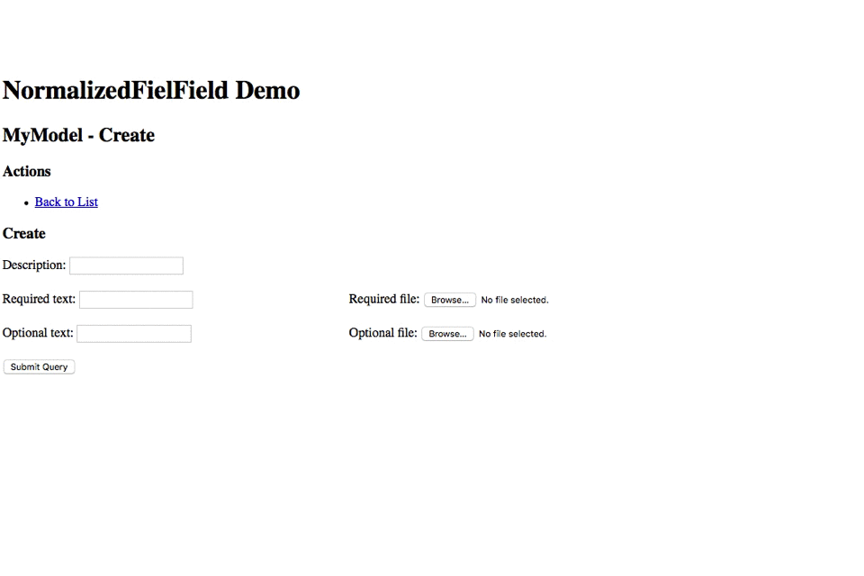

# Normalized FileField

File field that behaves as close to other fields as possible.

v. 0.1.1

## Whaat?

This!

(animated gif)

## Whaaaaat?! I don get it!

Basic idea: I want to handle file inputs *no differently* from other inputs!

 * If a text input can have its value "sent back" when form validation fails,
   so must the file input!
 * Even when a file field is required, user should still be able to clear it 
   (just as they can delete text in a required text field) no matter that the field 
   validation will fail!

File inputs in HTML are a bit different that other inputs ("text", "checkbox", etc).
Amount of data involved in a typical "file" field is much larger then what is in fields on any
other type. It is one thing to send and return (in the case of form validation error) a few 
characters in a text input, another thing completely to send and return megabytes of data in 
files - it's not practical.
   
On the server side this means that files have to be handled differently as well. Usually they are
saved in a temporary place and it is up to the developer to copy them where needed.

Django hides some of this boilerplate away, making working with file fields a bit simpler. 
But still it is different from other fields. As this package demonstrates, there is no real need 
for this, as file fields can be made to behave like other fields.

This package normalizes the behaviour of file fields by extending `django.forms.fields.FileField`
and altering its behaviour to be as close to other input types as possible.

It is meant to be a drop-in replacement for `django.forms.fields.FileField` though some 
considerations are needed.

## Versions

Testes in all combinations of:

| Django  | Python  |
|---------|---------|
| 1.7.11  | 2.7.10  |
| 1.8.8   | 3.4.3   |
| 1.9.1   | 3.5.1   |

## Differences from FileField

 * TODO expand this section with details
 
Not much... The "Clear" checkbox is present in some situations where the `ClearableFileInput`
does not render it. 

Also, there is a new state for the field. In addition to "empty" and "initial" that traditional
`ClearableFileInput` renders as a single HTML input element or as a double input with the link 
and label "Currently", this widget also has a "Selected" state. This is similar to state with the 
"Currently" link, but it renders just the name of the file without the link. It is used in 
situations when form validation has failed, but the file field is ok and the file has been saved to
temporary storage (cache).

## Usage

### In Models

A model field is provided to make use with models simpler. The only difference from the normal
`models.field.FileField` is that it specifies a different form field class, namely
`NormalizedFileField`.
    
    from normalized_filefield.model_field import NormalizedFileField
    
    class MyModel(models.Model):
        a_file = NormalizedFileField(upload_to='media/place')
        ...

Note: In keeping with (dubious) tradition of how field classes are named in Django 
(`forms.field.FileField` vs `models.fields.FileField`), this package also names form and model 
field the same, `NormalizedFileField`.

### In Forms

    from normalized_filefield.form_field import NormalizedFileField
    
    class MyModelForm(forms.ModelForm):
        a_file = NormalizedFileField()

Widget `normalized_filefield.widget.NormalizedFileInput` is only meant to be used together with
this form field class.

### Changing the markup

The widget markup can be changed. Nothing different here then what regular `ClearableFileInput`
provides. One difference is that template strings are made with the "format" syntax instead of 
the old "percent" syntax.

See `normalized_filefield.widget.VerboseHTMLMixin` for a very verbose markup option.

 * TODO expand this section 

## TODO

 - [ ] File cache storage seems not to clear automatically, 
 - [ ] Styleable version, JS 
 - [ ] Image Field
 - [ ] Clean up the widget and form classes (make more mixin-friendly structure) 
